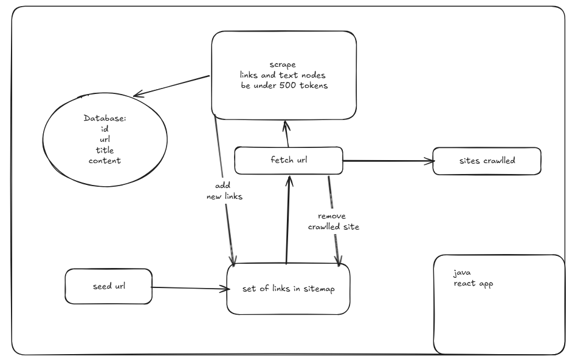
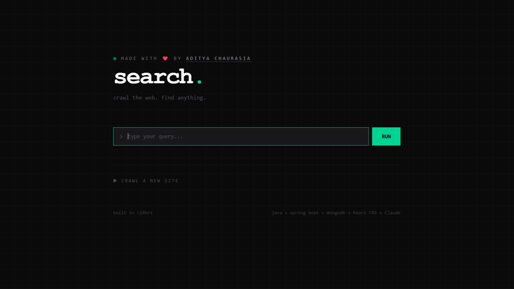
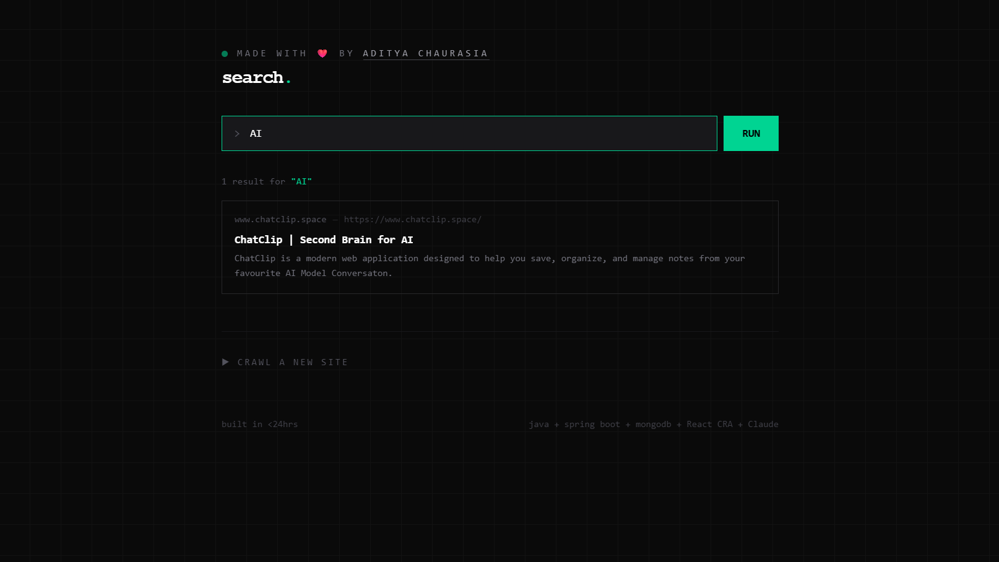

# Web Search Engine

A full-stack web crawler and search engine built with Java, Spring Boot, and MongoDB Atlas.



---

## Preview

<!-- Add your frontend screenshots here -->




---

## What It Does

- Crawls the web starting from a seed URL
- Extracts page title and content (meta description or first 500 characters of body)
- Stores crawled pages in MongoDB Atlas
- Full-text search with relevance scoring via Atlas Search
- Deduplicates URLs to avoid crawling the same page twice
- Respects `robots.txt` rules
- Reads `sitemap.xml` for additional URLs
- Skips non-HTML files (PDFs, images, etc.)

---

## Tech Stack

**Backend**

- Java 26 + Spring Boot 4
- MongoDB Atlas + Atlas Search
- jsoup — web crawling and HTML parsing
- Maven

**Frontend**

- React + Vite
- Tailwind CSS

---

## Project Structure

```
websearch/
├── frontend/                          # React frontend
│   └── src/
│       └── App.jsx
└── src/main/java/com/chatclip/websearch/
    ├── controller/
    │   └── HomeController.java        # HTTP endpoints
    ├── models/
    │   └── Models.java                # Page data model
    ├── repository/
    │   └── urlRepository.java         # MongoDB repository
    └── service/
        ├── webCrawler.java            # Crawler + robots.txt + sitemap
        └── webService.java            # Database + search service
```

---

## API Endpoints

| Method | Endpoint                              | Description                    |
| ------ | ------------------------------------- | ------------------------------ |
| GET    | `/search?q=query`                     | Full-text search crawled pages |
| GET    | `/startCrawl?url=https://example.com` | Start crawler from seed URL    |

---

## Setup

### Backend

1. Clone the repo
2. Copy `application.properties.example` to `application.properties`
3. Add your MongoDB Atlas connection string and password
4. Run:

```bash
mvn spring-boot:run
```

### Frontend

```bash
cd frontend
npm install
npm run dev
```

---

## MongoDB Atlas Search

Create a Search Index on the `webData` collection with dynamic mapping enabled. The backend uses an aggregation pipeline with `$search` to query across `title` and `content` fields with relevance scoring.

---

## Built In

Less than 24 hours. Zero prior Java experience.  
Age 19. Day 2 of learning Java.
